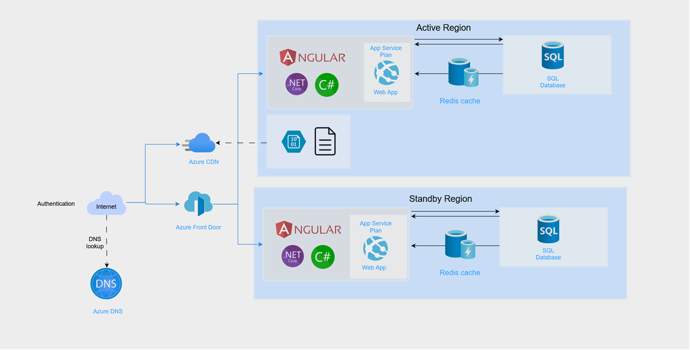
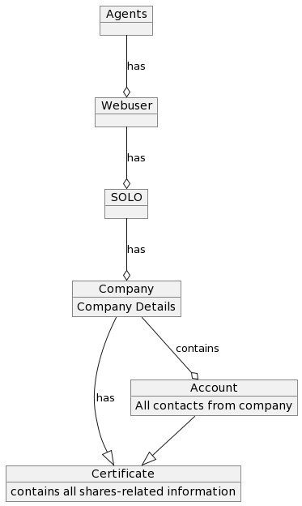

.. _techstackguide_01:

SOLO 2 - Tech Stack Guide
===========================

Introduction
-------------

This guide provides an overview of the technology stack used in our organization, detailing the implementation, systems, programming languages, databases, and other key components.

Implementation
---------------

Servers and Cloud Computing
------------------------------

- **Platform**: MS Azure
- **Usage**: Utilized across all our businesses.

Operating Systems
---------------------

- **Server OS**: Windows and Linux Servers

Programming Languages
---------------------------

- **Backend**: .NET Core Framework, C#
- **Dotnet Version**: 8.0
- **Frontend**: Angular 15

Databases and Database Management Systems
--------------------------------------------

- **Database**: Azure SQL Database

Managed vs. Self-Managed Tech
---------------------------------

- **Management Style**: Azure-managed.

System Diagram
-------------------

Data Model
----------------

